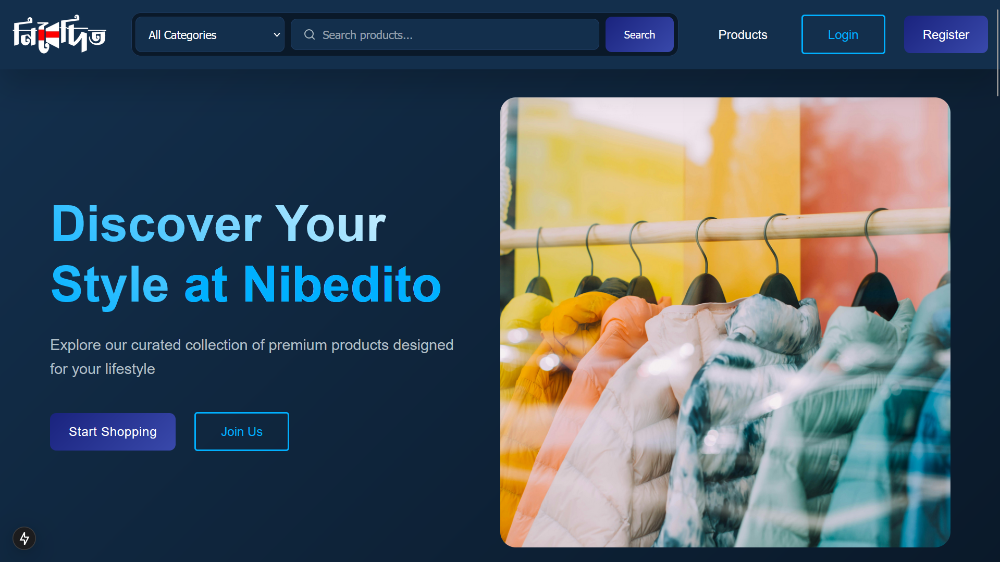
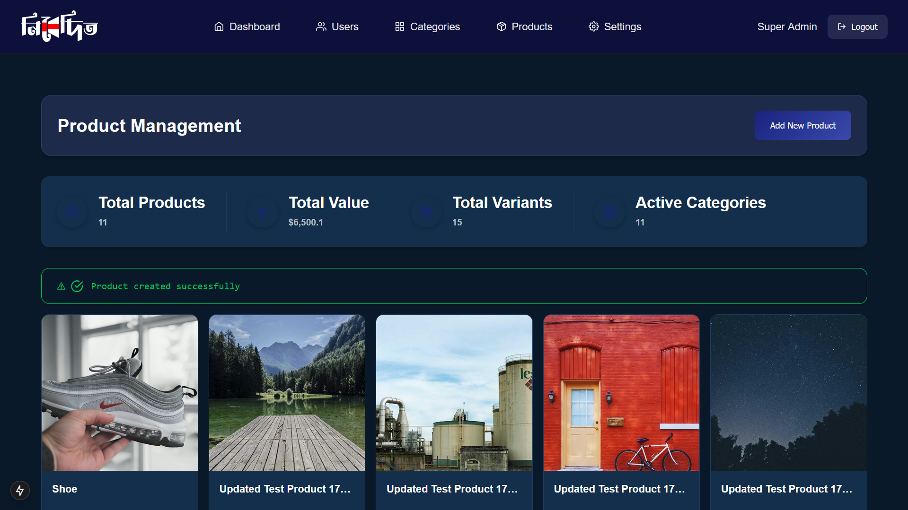
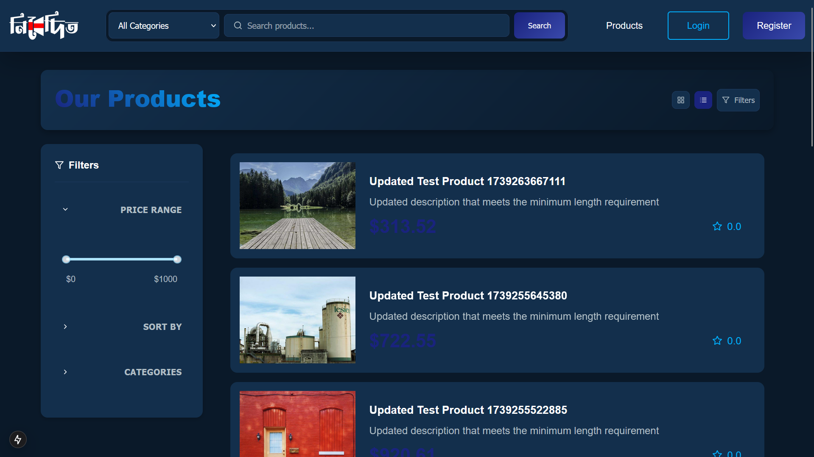
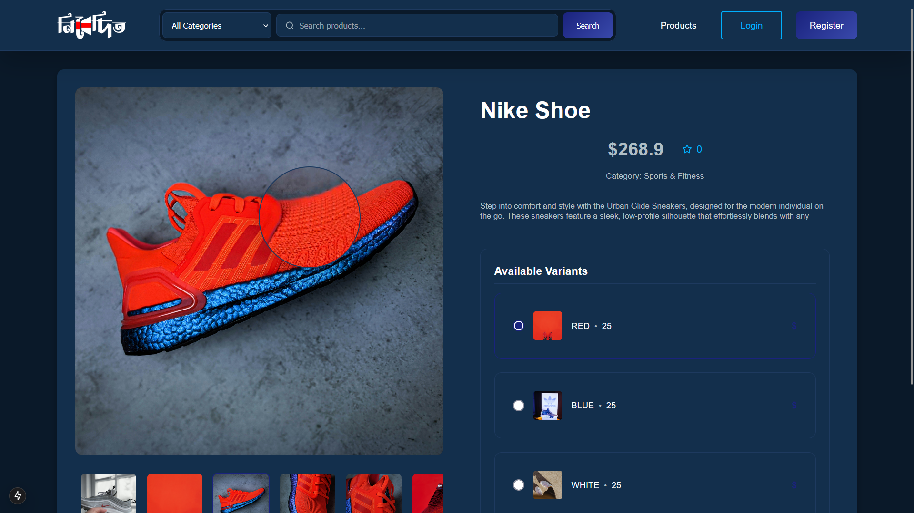

# Nibedito E-commerce Frontend

## Demo Screenshots

## Overview
Frontend application for Nibedito E-commerce platform, built with Next.js 14. Features a responsive user interface for both customers and administrators.

## Tech Stack
- Next.js 14 (App Router)
- React.js
- Vanilla CSS
- Axios for API calls
- React Icons
- Context API for state management

## Current Features

### User Interface
- Responsive layout for all devices
- Protected routes implementation
- Form validation with error handling
- Real-time user feedback
- Advanced product image zoom functionality
- Grid/List view toggle for products

### Authentication
- User login/register system
- Email verification flow
- Password reset functionality
- Persistent sessions with localStorage

### User Dashboard
- Profile information management
- Multiple address handling
- Profile picture upload
- Verification status display
- Security settings

### Product Management
- Product catalog with filtering and sorting
- Category-based product organization
- Product variants support
- Image magnification on hover
- Detailed product views with variants
- Price range filtering
- Multiple product images support

### Admin Portal
- Secure admin login
- Dashboard with statistics
- User management interface
- Ban/Unban functionality
- Admin profile section
- Category management
- Product management dashboard
- Variant management system
- Product image management

### Category Management
- Category creation and editing
- Category image upload
- Active/Inactive status toggle
- Category listing and grid views
- Category-product associations

## In Progress Features
- Shopping cart implementation
- Order management system
- User reviews & ratings
- Search functionality
- Wishlist system
- Payment gateway integration

## Known Issues
- Search functionality needs optimization
- Mobile responsive improvements needed
- Admin Dashboard is not fully functional
- Filtering and Sorting is not working properly
- Image size is not optimized